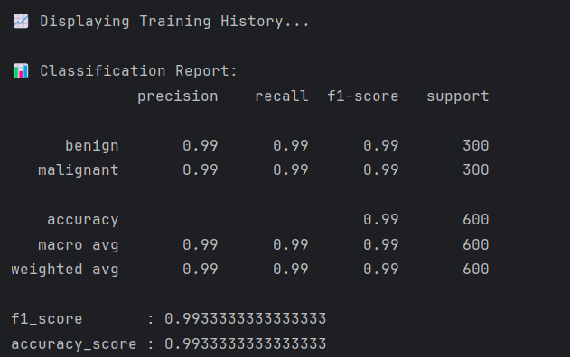
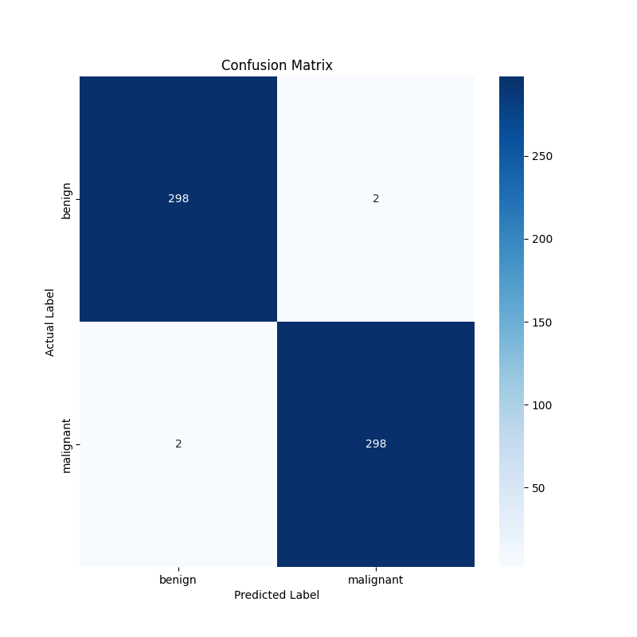
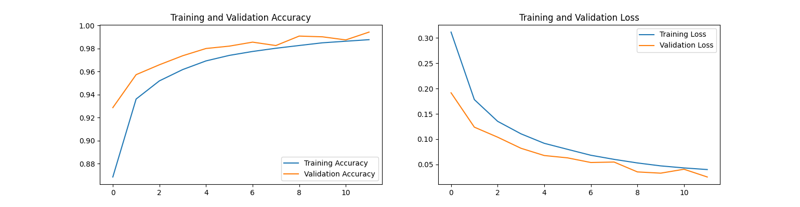
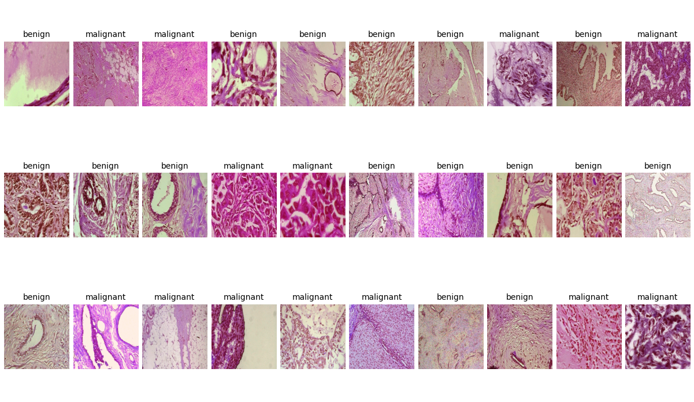
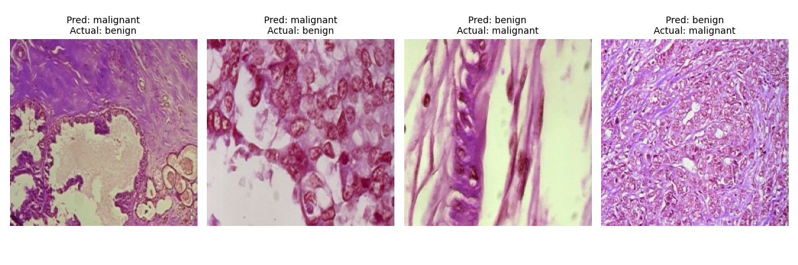
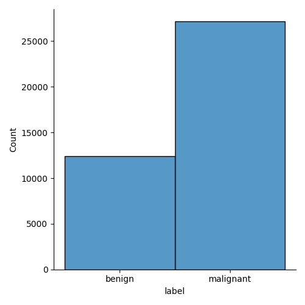
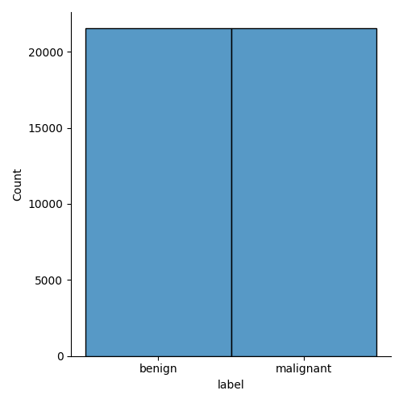

# Automated Histopathology Image Classification for Breast Cancer Detection

This project provides a deep learning pipeline for classifying breast cancer histopathology images as either benign or malignant. [cite_start]Utilizing transfer learning with a pre-trained ResNet50 model, the system achieves **99.44% accuracy** on the BreaKHis dataset[cite: 78]. [cite_start]A key feature of this project is the integration of Grad-CAM[cite: 21], a visualization technique that makes the model's decisions interpretable by highlighting the image regions most influential to its prediction.

[cite_start]This project was developed as a minor project for the B.Tech (CSE) curriculum, demonstrating a complete workflow from data processing to model evaluation and interpretation[cite: 5, 6].

## Key Features
- **High Performance:** Achieved **99.44% accuracy** on the held-out test set.
- **Deep Learning Model:** Built on a **ResNet50** architecture using TensorFlow and Keras for transfer learning.
- [cite_start]**Robust Data Pipeline:** Features a comprehensive data processing workflow that handles class imbalance via upsampling and uses data augmentation (rotations, flips, crops) [cite: 31] to improve model generalization.
- [cite_start]**Model Interpretability:** Integrates **Grad-CAM** visualizations to produce heatmaps that explain the model's predictions, a crucial step for building trust in clinical AI tools[cite: 21, 22].

## Results
The model was trained successfully on a balanced dataset and achieved an excellent final accuracy of **99.33%** on the unseen test set.

### Quantitative Results
The classification report provides a detailed breakdown of the model's high performance across both classes, and the confusion matrix shows only 4 errors were made on 600 test images.

| Classification Report | Confusion Matrix |
| :---: | :---: |
|  |  |

### Performance Visualizations
The training history shows a stable and consistent learning curve, with validation accuracy steadily increasing and loss decreasing over 12 epochs.



### Prediction Examples
Below is a sample of the model's correct predictions on the test set, followed by a visualization of all four images it classified incorrectly.

| Sample of Correct Predictions | All Incorrect Predictions |
| :---: | :---: |
|  |  |

### Data Preparation Overview
The initial dataset was imbalanced. A robust data pipeline was engineered to create a perfectly balanced training set through upsampling.

| Original Imbalanced Dataset | Final Balanced Training Set |
| :---: | :---: |
|  |  |

### Grad-CAM Visualization
The Grad-CAM heatmaps highlight the regions the model focused on. For the correctly classified malignant image, the model correctly focuses on the dense, abnormal cell nuclei, ignoring the surrounding tissue.


## Setup & Usage

### **Prerequisites**
- Python 3.8+
- [cite_start]The BreaKHis dataset [cite: 78]

### **Installation**
1.  Clone the repository:
    ```bash
    git clone [https://github.com/your-username/Breast-Cancer-Histopathology-Classification.git](https://github.com/your-username/Breast-Cancer-Histopathology-Classification.git)
    cd Breast-Cancer-Histopathology-Classification
    ```
2.  Create and activate a virtual environment:
    ```bash
    python -m venv venv
    source venv/bin/activate  # On Windows, use `venv\Scripts\activate`
    ```
3.  Install the required dependencies:
    ```bash
    pip install -r requirements.txt
    ```
4.  [cite_start]**Data Setup:** Download the **BreaKHis dataset** [cite: 78] and place the `BreaKHis_v1` folder inside the `data/` directory.

### **Usage**
1.  **Train the model** (this will take several hours):
    ```bash
    python src/train.py
    ```
2.  **Evaluate the model** and generate all reports and plots:
    ```bash
    python src/evaluate.py
    ```
3.  **Generate Grad-CAM** visualizations:
    ```bash
    python src/gradcam.py
    ```

