# Automated Histopathology Image Classification for Breast Cancer Detection

This project presents a deep learning pipeline for breast cancer histopathology image classification using the **BreaKHis** dataset. The work covers both:

- **Binary classification** of histopathology images into **benign** and **malignant**
- **Multi-class classification** into **8 breast tumor subtypes**

The project uses **transfer learning** with **ResNet50** and **EfficientNet-based architectures** to classify breast cancer tissue images and compare performance across binary and subtype-level classification tasks.

## Project Overview

Breast cancer diagnosis through histopathological image analysis is a critical but challenging task. Manual interpretation can be time-consuming and may vary across observers. This project explores how deep learning can support automated analysis of breast cancer histopathology images by building a complete pipeline for:

- data preparation
- class balancing
- image augmentation
- model training
- model evaluation
- result visualization

The system was developed as part of a B.Tech minor project focused on applying deep learning in medical image analysis.

## Dataset

The project uses the **BreaKHis** dataset, a public breast cancer histopathological image dataset containing images at multiple magnification levels: **40×, 100×, 200×, and 400×**.

The dataset includes:

### Binary classes
- benign
- malignant

### Eight subtypes
**Benign**
- adenosis
- fibroadenoma
- phyllodes_tumor
- tubular_adenoma

**Malignant**
- ductal_carcinoma
- lobular_carcinoma
- mucinous_carcinoma
- papillary_carcinoma

A patient-level split was used to reduce the risk of data leakage during training and evaluation. 

## Models Used

This project evaluates transfer learning using:

- **ResNet50**
- **EfficientNet-based model** for 8-class classification

Both models use pretrained ImageNet weights and are adapted for breast cancer histopathology image classification.

## Preprocessing and Training Pipeline

The project includes a structured preprocessing pipeline designed for medical image classification:

- images resized to **224 × 224**
- model-specific preprocessing
- data augmentation
- class balancing using upsampling
- training / validation / test split
- performance tracking using accuracy, loss, confusion matrix, and classification report

Data augmentation helps improve generalization, while class balancing reduces bias toward majority classes. 

## Results Summary

### 1. Binary Classification using ResNet50
The binary classification model achieved strong performance in distinguishing **benign** and **malignant** tissue images.

- **Test Accuracy:** **99.33%**
- **Precision / Recall / F1-score:** **0.99** for both classes

### 2. 8-Class Classification using ResNet50
The ResNet50 multi-class model showed strong performance across most subtypes.

- **Overall Accuracy:** **98%**
- Strong precision, recall, and F1-score across most classes
- Slightly lower performance for some visually similar subtypes such as **lobular carcinoma**

### 3. 8-Class Classification using EfficientNet
The EfficientNet-based model achieved competitive performance with a more parameter-efficient architecture.

- **Overall Accuracy:** **97%**
- Stable learning behavior
- Competitive subtype classification performance with fewer parameters

These results are consistent with the project report and presentation material. 

## Output Structure

The repository includes organized output folders for clear presentation of results:

```text
outputs/
├── binary_resnet/
├── dataset_analysis/
├── multiclass_resnet/
└── multiclass_efficientnet/
```

## Dataset Analysis Outputs

### Dataset Distribution
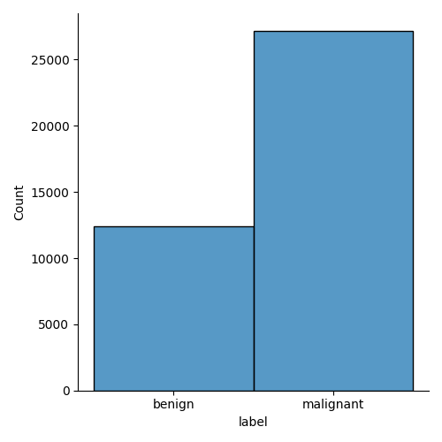

### Train / Validation / Test Split Distribution
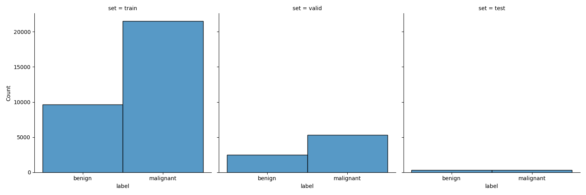

### Balanced Training Set
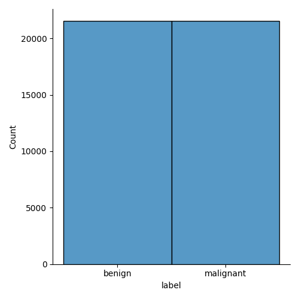

## Binary Classification Results (ResNet50)

### Classification Report
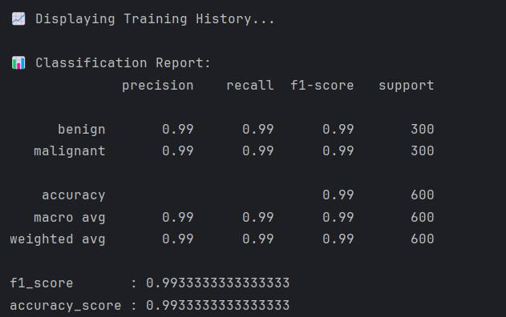

### Confusion Matrix
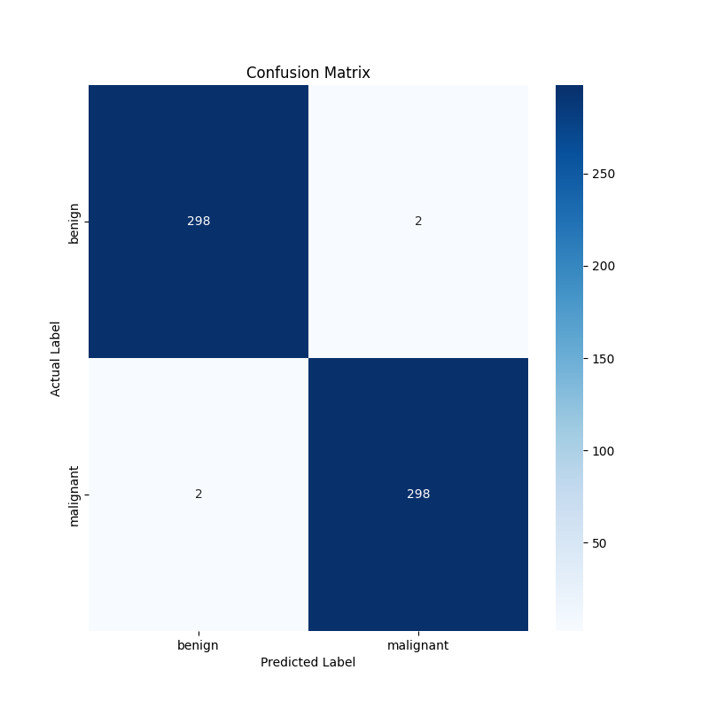

### Training History
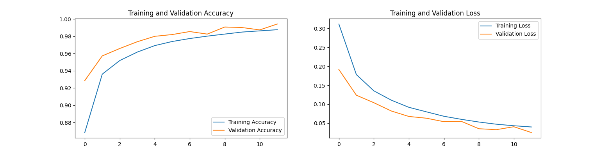

### Sample Predictions
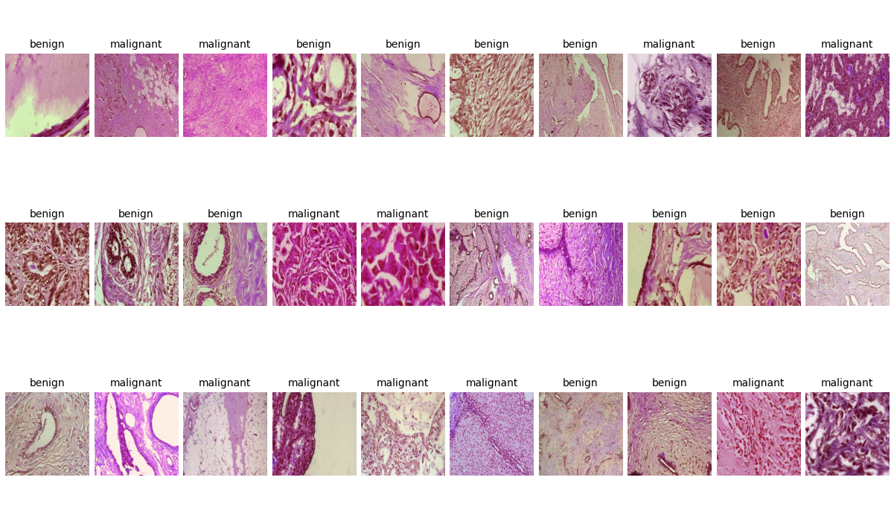

### Wrong Predictions
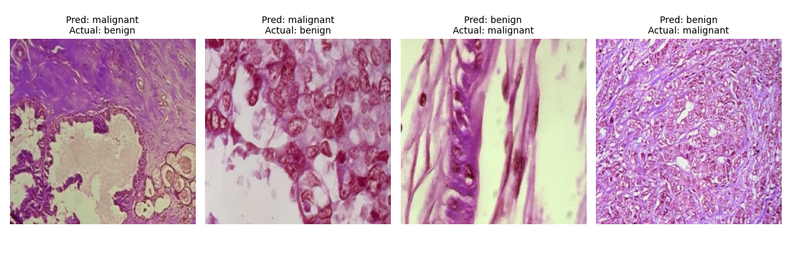

## 8-Class Classification Results (ResNet50)

### Classification Report
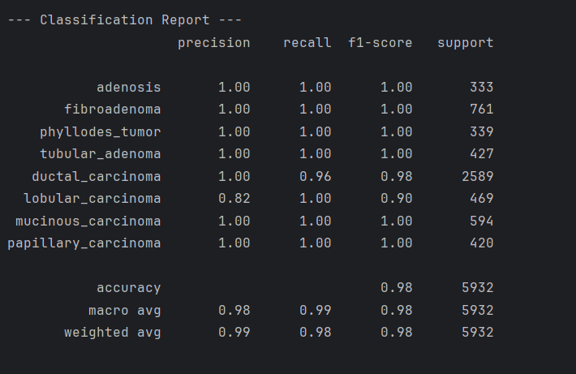

### Confusion Matrix
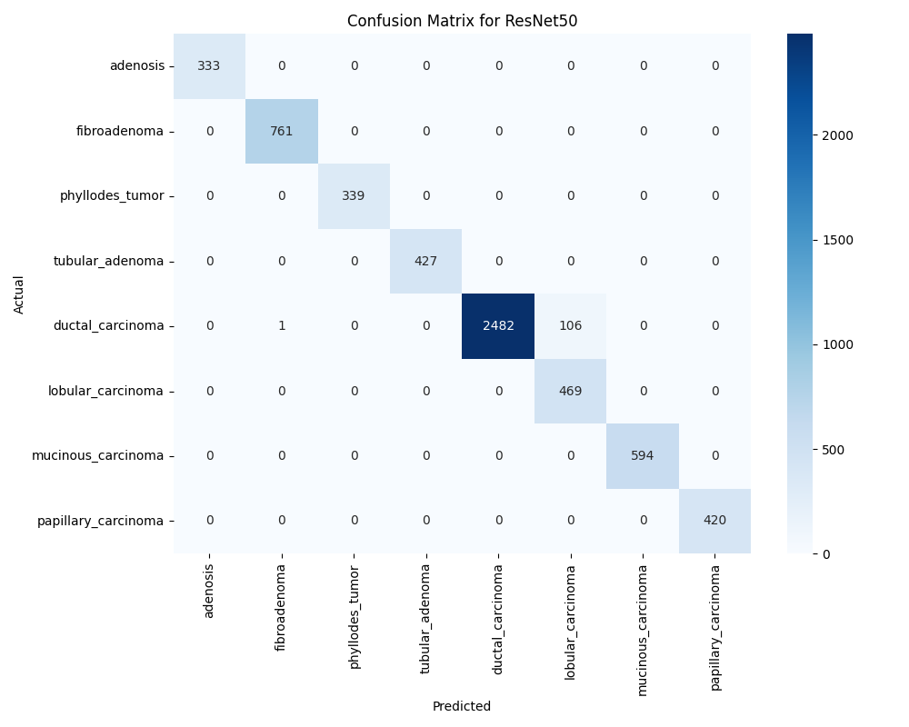

### Training History
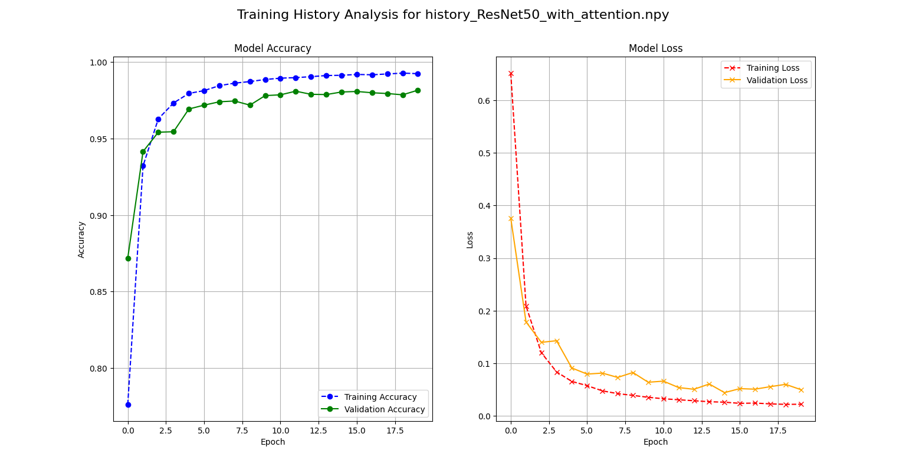

## 8-Class Classification Results (EfficientNet)

### Classification Report
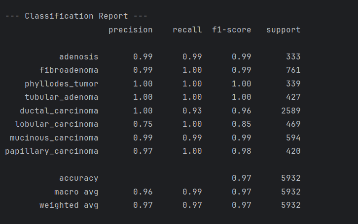

### Confusion Matrix
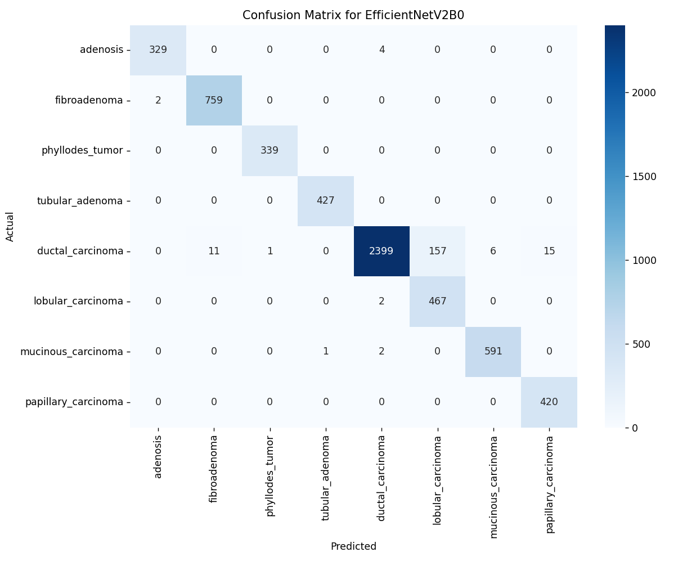

### Training History
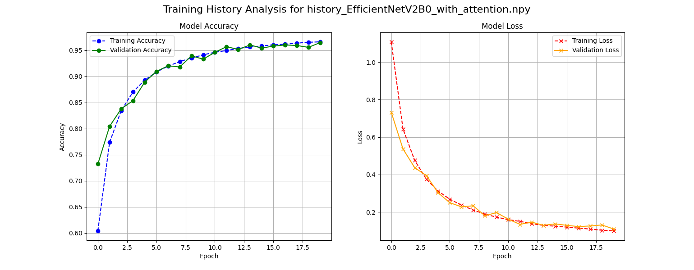

## Key Highlights

- unified pipeline for binary and multi-class breast cancer histopathology classification
- transfer learning with ResNet50 and EfficientNet-based models
- strong binary classification accuracy of 99.33%
- strong 8-class subtype classification performance
- clear output visualizations for interview and presentation use

## Tech Stack

- Python
- TensorFlow / Keras
- NumPy
- Pandas
- Matplotlib
- Seaborn
- scikit-learn

## Project Structure

```text
MinorProj/
├── data/
├── outputs/
│   ├── binary_resnet/
│   ├── dataset_analysis/
│   ├── multiclass_resnet/
│   └── multiclass_efficientnet/
├── src/
│   ├── dataset.py
│   ├── debug_pipeline.py
│   ├── evaluate.py
│   ├── helpers.py
│   └── train.py
├── README.md
├── requirements.txt
└── .gitignore
```

## Setup

### 1. Clone the repository
```bash
git clone https://github.com/sujal-dhawan/Breast-Cancer-Histopathology-Classification.git
cd Breast-Cancer-Histopathology-Classification
```
### 2. Create and activate virtual environment
```bash
python -m venv .venv
```
On Windows:
```bash
.venv\Scripts\activate
```

### 3. Install dependencies
```bash
pip install -r requirements.txt
```

### 4. Dataset setup

Download the BreaKHis dataset and place the dataset folder inside the data/ directory.

## Usage

### Train the model
```bash
python src/train.py
```

### Evaluate the model and generate outputs
```bash
python src/evaluate.py
```

## Notes
- Model weight files such as .h5 are not included in the repository to keep the project lightweight and clean.
- The repository focuses on code, outputs, and visual results for clear presentation.
- Binary classification outputs and 8-class classification outputs are both included for comparison.


## Future Work
- improve interpretability using Grad-CAM or related visualization methods
- test on additional datasets for better generalization
- deploy through a simple GUI or web interface
- optimize for resource-constrained environments


### Author

### Sujal Dhawan
B.Tech CSE, Amity University
